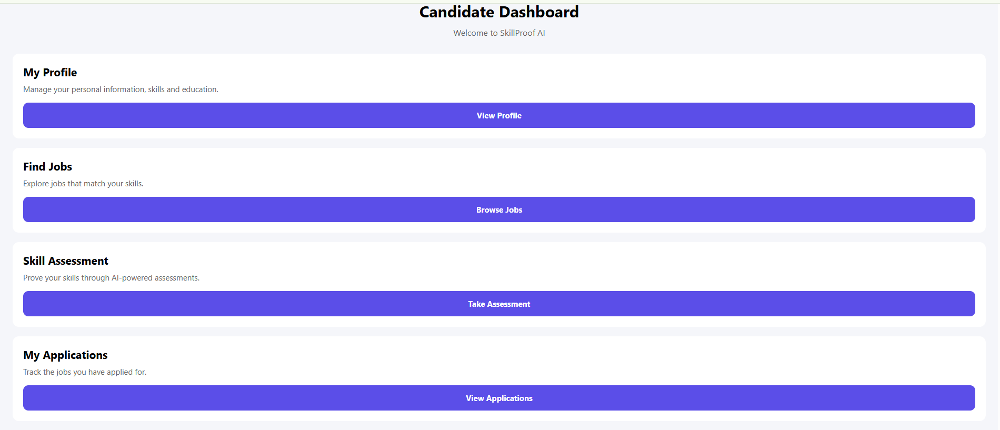

# SkillProof AI

SkillProof AI is a full-stack AI-powered recruitment and skill assessment mobile application built with React Native, Expo, Node.js, Express, and MongoDB.

The platform connects candidates and companies through job discovery, skill matching, applications, resume management, and job-specific assessments.

## Features

### Candidate

- Candidate signup and login
- Candidate dashboard
- Profile management
- Skills and education management
- Job discovery
- Skill matching percentage
- Job applications
- Application status tracking
- Resume PDF upload
- Resume viewing
- Job-specific assessments
- Timed assessments
- Assessment submission
- Automatic scoring
- Pass / Fail results
- Assessment results stored in MongoDB

### Company

- Company signup and login
- Company dashboard
- Create jobs
- Edit jobs
- Delete jobs
- Manage job postings
- View candidate applications
- Update application status
- View candidate profiles
- View candidate resumes
- Create assessments
- Edit assessments
- Publish assessments
- Delete assessments
- Assign assessments to specific jobs

## Tech Stack

### Mobile App

- React Native
- Expo
- Expo Router
- TypeScript

### Backend

- Node.js
- Express.js
- MongoDB
- Mongoose
- JWT Authentication
- bcryptjs
- Multer

### Deployment

- Backend deployed on Render
- Source code hosted on GitHub

## Architecture

```text
SkillProof AI
│
├── Mobile App
│   ├── Candidate
│   │   ├── Authentication
│   │   ├── Dashboard
│   │   ├── Profile
│   │   ├── Jobs
│   │   ├── Applications
│   │   ├── Resume
│   │   └── Assessments
│   │
│   └── Company
│       ├── Authentication
│       ├── Dashboard
│       ├── Jobs
│       ├── Applications
│       └── Assessments
│
└── Backend
    ├── REST APIs
    ├── Authentication
    ├── Job Management
    ├── Applications
    ├── Resume Uploads
    ├── Assessments
    └── MongoDB